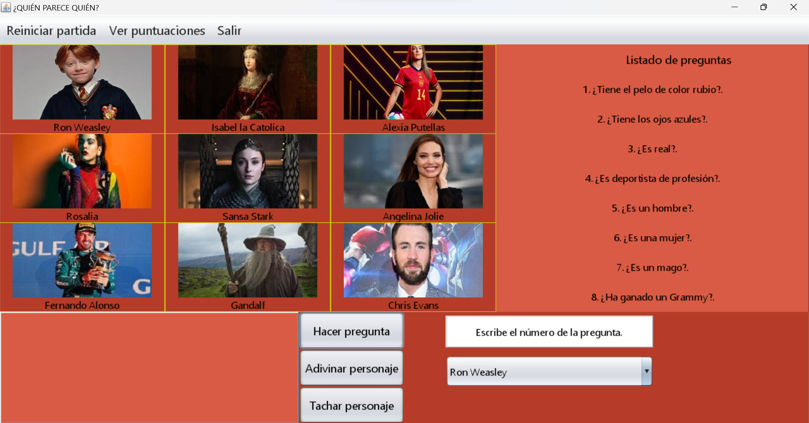

# ¿Quién Parece Quién? - Juego de Adivinanzas

## Descripción
Un juego de adivinanzas estilo "¿Quién es Quién?" desarrollado en Java donde debes adivinar un personaje elegido al azar realizando preguntas sobre sus características.

## Características
- Interfaz gráfica desarrollada con Java Swing
- Sistema de puntuaciones que se guardan en archivo
- Base de datos de personajes utilizando DB4O
- Modo de juego interactivo con preguntas y respuestas
- Sistema para tachar personajes descartados

## Tecnologías utilizadas
- Java 8
- DB4O para persistencia de datos
- Swing para la interfaz gráfica
- Absolute Layout para diseño de pantallas

## Estructura del proyecto
- `src/trabajo/` - Código fuente del juego
  - `PantallaInicio.java` - Pantalla principal
  - `PantallaJuego.java` - Lógica del juego
  - `Personaje.java` - Modelo de datos de personajes
  - `Puntuaciones.java` - Gestión de puntuaciones
  - `ConexionDB4O.java` - Conexión con la base de datos

## Cómo ejecutar
1. Asegúrate de tener Java 8 o superior instalado
2. Abre el proyecto en NetBeans 
3. Ejecuta la clase `PantallaInicio.java`

## Autor
- Noe P.

## Versión 
1.0
